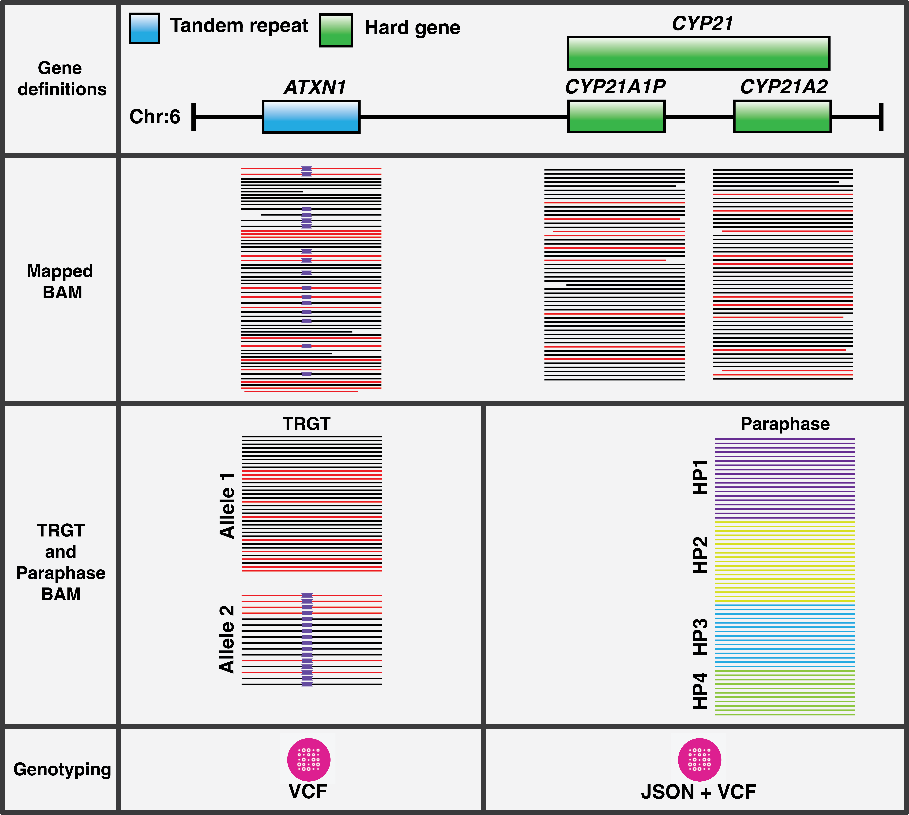

## Workflow outputs

PTCP generates a comprehensive set of output files for each sample, providing detailed analysis results across multiple analysis domains. The workflow produces files for tandem repeat analysis, gene phasing, structural variant detection, and quality control metrics.

### WDL specification

| Name                            | Type                 | Description                                                                                          | Notes                                                                              |
| ------------------------------- | -------------------- | ---------------------------------------------------------------------------------------------------- | ---------------------------------------------------------------------------------- |
| `sample_names`                  | `Array[String]`      | Sample names, in same order as other arrays                                                          |                                                                                    |
| `mapped_bam`                    | `Array[File]`        | BAM with reference genome alignments                                                                 | [details](https://github.com/PacificBiosciences/pbmm2)                             |
| `mapped_bam_bai`                | `Array[File]`        | Index for above                                                                                      |                                                                                    |
| `trgt_vcf`                      | `Array[File]`        | VCF of tandem repeat genotypes                                                                       | [details](https://github.com/PacificBiosciences/trgt/blob/main/docs/vcf_files.md)  |
| `trgt_spanning_bam`             | `Array[File]`        | BAM of clipped spanning reads overlapping repeat regions                                             |                                                                                    |
| `trgt_spanning_bam_bai`         | `Array[File]`        | Index for above                                                                                      |                                                                                    |
| `images_motifs_allele`          | `Array[File]`        | Zip of per-region images                                                                             | [details](https://github.com/PacificBiosciences/trgt/blob/main/docs/trvz-plots.md) |
| `images_meth_allele`            | `Array[File]`        | Zip of per-region images                                                                             | [details](https://github.com/PacificBiosciences/trgt/blob/main/docs/trvz-plots.md) |
| `images_motifs_waterfall`       | `Array[File]`        | Zip of per-region images                                                                             | [details](https://github.com/PacificBiosciences/trgt/blob/main/docs/trvz-plots.md) |
| `images_meth_waterfall`         | `Array[File]`        | Zip of per-region images                                                                             | [details](https://github.com/PacificBiosciences/trgt/blob/main/docs/trvz-plots.md) |
| `reads_overlapping_repeats`     | `Array[File]`        | BAM of reads overlapping repeat regions                                                              |                                                                                    |
| `reads_overlapping_repeats_bai` | `Array[File]`        | Index for above                                                                                      |                                                                                    |
| `paraphase_bam`                 | `Array[File]`        | BAM of reads phased by Paraphase, all haplotypes are aligned against the main gene of interest       |                                                                                    |
| `paraphase_bam_bai`             | `Array[File]`        | Index for above                                                                                      |                                                                                    |
| `paraphase_json`                | `Array[File]`        | JSON that summarizes haplotypes and variant calls for each gene family in each sample                |                                                                                    |
| `paraphase_vcfs`                | `Array[Array[File]]` | VCFs of small variants, a VCF file is written for each region (gene family)                          | [details](https://github.com/PacificBiosciences/paraphase/blob/main/docs/vcf.md)   |
| `havanno_json`                  | `Array[File?]`       | JSON file annotating Paraphase output with variants of interest                                      | [details](docker/ptcp/scripts/havanno/README.md)                                   |
| `f8_vcf`                        | `Array[File]`        | VCF of *F8* inversion calls                                                                          |                                                                                    |
| `f8_json`                       | `Array[File]`        | JSON of evidence for *F8* inversion calls                                                            |                                                                                    |
| `sawfish_minimap2_bam`          | `Array[File]`        | BAM of reads aligned with minimap2 used by Sawfish (this only includes reads in ~80kb window on HBA) |                                                                                    |
| `sawfish_minimap2_bam_bai`      | `Array[File]`        | Index for above                                                                                      |                                                                                    |
| `sawfish_vcf`                   | `Array[File]`        | VCF of SVs called by Sawfish                                                                         |                                                                                    |
| `sawfish_vcf_tbi`               | `Array[File]`        | Index for above                                                                                      |                                                                                    |
| `ptcp_qc_reports`               | `Array[File]`        | JSONs of ptcp-qc per sample and aggregate reports                                                    |                                                                                    |

### Example outputs.json

Here's an example of what the workflow outputs look like for the Coriell sample **HG00281**:

```json
{
  "ptcp.f8_json": ["ptcp/out/HG00281.f8inversion.json"],
  "ptcp.f8_vcf": ["ptcp/out/HG00281.f8inversion.vcf"],
  "ptcp.havanno_json": ["ptcp/out/HG00281.havanno.json"],
  "ptcp.images_meth_allele": ["ptcp/out/HG00281.meth_allele.trgt_plots.zip"],
  "ptcp.images_meth_waterfall": ["ptcp/out/HG00281.meth_waterfall.trgt_plots.zip"],
  "ptcp.images_motifs_allele": ["ptcp/out/HG00281.motifs_allele.trgt_plots.zip"],
  "ptcp.images_motifs_waterfall": ["ptcp/out/HG00281.motifs_waterfall.trgt_plots.zip"],
  "ptcp.mapped_bam": ["ptcp/out/HG00281.mapped.bam"],
  "ptcp.mapped_bam_bai": ["ptcp/out/HG00281.mapped.bam.bai"],
  "ptcp.paraphase_bam": ["ptcp/out/HG00281_paraphase/HG00281.paraphase.bam"],
  "ptcp.paraphase_bam_bai": ["ptcp/out/HG00281_paraphase/HG00281.paraphase.bam.bai"],
  "ptcp.paraphase_json": ["ptcp/out/HG00281_paraphase/HG00281.paraphase.json"],
  "ptcp.paraphase_vcfs": [
    [
      "ptcp/out/HG00281_paraphase/HG00281_paraphase_vcfs/HG00281_cyp21.vcf",
      "ptcp/out/HG00281_paraphase/HG00281_paraphase_vcfs/HG00281_gba.vcf",
      "ptcp/out/HG00281_paraphase/HG00281_paraphase_vcfs/HG00281_hba.vcf",
      "ptcp/out/HG00281_paraphase/HG00281_paraphase_vcfs/HG00281_hbb.vcf",
      "ptcp/out/HG00281_paraphase/HG00281_paraphase_vcfs/HG00281_rpgr.vcf",
      "ptcp/out/HG00281_paraphase/HG00281_paraphase_vcfs/HG00281_smn1.vcf"    
    ]
  ],
  "ptcp.ptcp_qc_reports": ["ptcp/out/ptcp_qc/qc.HG00281.json"],
  "ptcp.reads_overlapping_repeats": ["ptcp/out/HG00281.repeats.bam"],
  "ptcp.reads_overlapping_repeats_bai": ["ptcp/out/HG00281.repeats.bam.bai"],
  "ptcp.sample_names": ["HG00281"],
  "ptcp.sawfish_minimap2_bam": ["ptcp/out/HG00281.minimap2.bam"],
  "ptcp.sawfish_minimap2_bam_bai": ["ptcp/out/HG00281.minimap2.bam.bai"],
  "ptcp.sawfish_vcf": ["ptcp/out/HG00281_sawfish/HG00281.sv.vcf.gz"],
  "ptcp.sawfish_vcf_tbi": ["ptcp/out/HG00281_sawfish/HG00281.sv.vcf.gz.tbi"],
  "ptcp.trgt_spanning_bam": ["ptcp/out/HG00281.trgt.sorted.spanning.bam"],
  "ptcp.trgt_spanning_bam_bai": ["ptcp/out/HG00281.trgt.sorted.spanning.bam.bai"],
  "ptcp.trgt_vcf": ["ptcp/out/HG00281.trgt.vcf"]
}
```

### Output file descriptions

The following sections provide detailed descriptions of each output type. Some outputs are self-explanatory (such as index files), while others contain analysis results that require more detailed explanation which will be in context of sample HG00281.

#### Table of Contents

- [Sample information](#sample-information)
- [Reference genome alignment](#reference-genome-alignment)
- [Tandem repeat analysis (TRGT)](#tandem-repeat-analysis-trgt)
- [Visualization images](#visualization-images)
- [Repeat region analysis](#repeat-region-analysis)
- [Gene phasing (Paraphase)](#gene-phasing-paraphase)
- [Variant annotation (Havanno)](#variant-annotation-havanno)
- [F8 inversion analysis](#f8-inversion-analysis)
- [Structural variant detection (Sawfish)](#structural-variant-detection-sawfish)
- [Quality control](#quality-control)

#### Sample information
- **`sample_names`** (`Array[String]`): Contains the sample identifiers in the same order as all other output arrays. This ensures you can correlate outputs with the correct sample.

#### Reference genome alignment
- **`mapped_bam`** (`Array[File]`): BAM files containing HiFi (+failed) reads aligned to the reference genome using pbmm2. These files serve as the foundation for all downstream analyses and contain the primary alignment information for each sample.

- **`mapped_bam_bai`** (`Array[File]`): BAI index files for the mapped BAM files, enabling efficient random access to specific genomic regions during analysis.

#### Tandem repeat analysis (TRGT)
- **`trgt_vcf`** (`Array[File]`): VCF files containing tandem repeat genotype calls generated by TRGT. These files include repeat length estimates, motif sequences, and quality metrics for each targeted repeat region.

- **`trgt_spanning_bam`** (`Array[File]`): BAM files containing reads that span across tandem repeat regions.

- **`trgt_spanning_bam_bai`** (`Array[File]`): Index files for the TRGT spanning BAM files.

- **`images_motifs_allele`** (`Array[File]`): ZIP archives containing per-locus visualizations showing motifs for each allele. These images help visualize the structure and composition of tandem repeats.

- **`images_meth_allele`** (`Array[File]`): ZIP archives containing per-locus visualizations visualization images for each allele with methylation shown, providing insights into epigenetic modifications within repeat regions.

- **`images_motifs_waterfall`** (`Array[File]`): ZIP archives containing waterfall plot visualizations showing motif patterns.

- **`images_meth_waterfall`** (`Array[File]`): ZIP archives containing waterfall plot visualizations showing methylation patterns.

- **`reads_overlapping_repeats`** (`Array[File]`): BAM files containing all reads that overlap with targeted repeat regions for repeated analysis.

- **`reads_overlapping_repeats_bai`** (`Array[File]`): Index files for the reads overlapping repeats BAM files.

#### Gene phasing (Paraphase)
- **`paraphase_bam`** (`Array[File]`): BAM files containing reads that have been phased by Paraphase, with all haplotypes aligned against the main gene of interest.

- **`paraphase_bam_bai`** (`Array[File]`): Index files for the Paraphase BAM files.

- **`paraphase_json`** (`Array[File]`): JSON files summarizing haplotypes and variant calls for each gene family in each sample. These files provide structured data about gene phasing results and are particularly important for downstream analysis and interpretation.

- **`paraphase_vcfs`** (`Array[Array[File]]`): VCF files containing small variant calls, with one VCF file generated for each targeted region (gene family).

#### Variant annotation (Havanno)
- **`havanno_json`** (`Array[File?]`): JSON files that annotate Paraphase output with variants of interest. These files provide additional context for detected variants, e.g., annotate the number of pathogenic or pseudogene-specific variants on a haplotype.

#### F8 inversion analysis
- **`f8_vcf`** (`Array[File]`): VCF files containing F8 inversion calls on intron 1 and intron 22.

- **`f8_json`** (`Array[File]`): JSON files containing detailed evidence supporting F8 inversion calls, including supporting read information, spans, and confidence metrics.

#### Structural variation detection (Sawfish)
- **`sawfish_minimap2_bam`** (`Array[File]`): BAM files containing reads aligned with minimap2 specifically for Sawfish analysis. These files focus on a window around the HBA region and the alignment is optimized for structural variant detection.

- **`sawfish_minimap2_bam_bai`** (`Array[File]`): Index files for the Sawfish minimap2 BAM files.

- **`sawfish_vcf`** (`Array[File]`): VCF files containing structural variant calls detected by Sawfish.

- **`sawfish_vcf_tbi`** (`Array[File]`): Index files for the Sawfish VCF files.

#### Quality control
- **`ptcp_qc_reports`** (`Array[File]`): JSON files containing comprehensive quality control metrics for each sample, plus an aggregate report across all samples. These reports include coverage statistics, alignment quality metrics, analysis-specific quality indicators, and expanded analysis on particular characterizations such as HBA and SMN1/2.

<h1 align="center"></h1>
